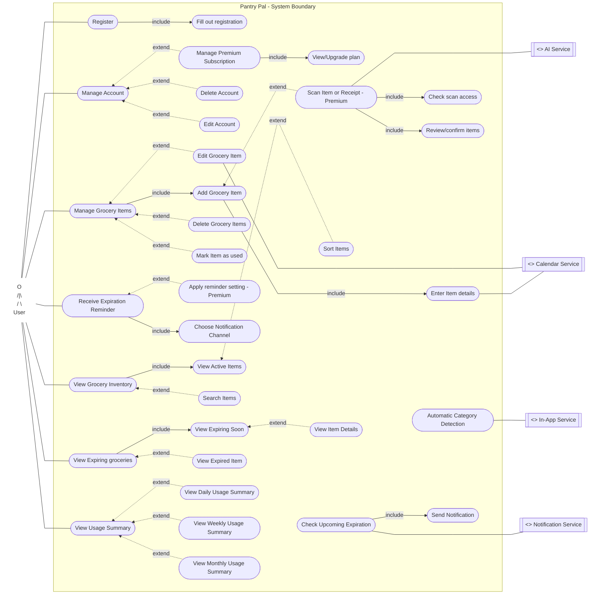

```mermaid
%%{init: {"flowchart": {"curve": "linear"}}}%%
flowchart LR
    User["O<br/>/|#92;<br/>/ #92;<br/>User"]

    subgraph SB["Pantry Pal - System Boundary"]
        REG([Register]) -->|include| FILL([Fill out registration])

        MACC([Manage Account])
        PREM([Manage Premium Subscription]) -.->|extend| MACC
        DEL([Delete Account]) -.->|extend| MACC
        EDITACC([Edit Account]) -.->|extend| MACC
        PREM -->|include| UPG([View/Upgrade plan])

        MGI([Manage Grocery Items])
        MGI -->|include| ADD([Add Grocery Item])
        EDITG([Edit Grocery Item]) -.->|extend| MGI
        DELG([Delete Grocery Items]) -.->|extend| MGI
        USED([Mark Item as used]) -.->|extend| MGI
        ADD -->|include| ENTER([Enter Item details])
        SCAN([Scan Item or Receipt - Premium]) -.->|extend| ADD
        SCAN -->|include| ACCESS([Check scan access])
        SCAN -->|include| REVIEW([Review/confirm items])

        REM([Receive Expiration Reminder])
        APPLY([Apply reminder setting - Premium]) -.->|extend| REM
        REM -->|include| CHAN([Choose Notification Channel])

        INV([View Grocery Inventory])
        INV -->|include| ACTIVE([View Active Items])
        SEARCH([Search Items]) -.->|extend| INV
        SORT([Sort Items]) -.->|extend| ACTIVE

        EXP([View Expiring groceries])
        EXP -->|include| SOON([View Expiring Soon])
        EXPIRED([View Expired Item]) -.->|extend| EXP
        DETAILS([View Item Details]) -.->|extend| SOON

        USAGE([View Usage Summary])
        DAILY([View Daily Usage Summary]) -.->|extend| USAGE
        WEEKLY([View Weekly Usage Summary]) -.->|extend| USAGE
        MONTHLY([View Monthly Usage Summary]) -.->|extend| USAGE

        CATDET([Automatic Category Detection])
        CHECK([Check Upcoming Expiration]) -->|include| SEND([Send Notification])
    end

    CAL[["<<system>> Calendar Service"]]
    AI[["<<system>> AI Service"]]
    APP[["<<system>> In-App Service"]]
    NOTIF[["<<system>> Notification Service"]]

    User --- REG & MACC & MGI & REM & INV & EXP & USAGE

    %% hidden links: pull the two system-driven use cases toward the right edge of the border
    DETAILS ~~~ CATDET
    ACTIVE ~~~ CHECK

    %% services (all in the same far-right column, outside the border)
    ENTER --- CAL
    EDITG --- CAL
    SCAN --- AI
    CATDET --- APP
    CHECK --- NOTIF

    %% hidden links: push every service past the border, AI above In-App
    REVIEW ~~~ CAL
    REVIEW ~~~ AI
    SEND ~~~ NOTIF

    %% invisible links: line up the services in one column (AI above In-App)
    ADD ~~~ CATDET
    ADD ~~~ CHECK

    %% hidden links: keep the original left-to-right layout (User left, services right)
    MACC ~~~ PREM
    MACC ~~~ DEL
    MACC ~~~ EDITACC
    MGI ~~~ EDITG
    MGI ~~~ DELG
    MGI ~~~ USED
    ADD ~~~ SCAN
    REM ~~~ APPLY
    INV ~~~ SEARCH
    ACTIVE ~~~ SORT
    EXP ~~~ EXPIRED
    SOON ~~~ DETAILS
    USAGE ~~~ DAILY
    USAGE ~~~ WEEKLY
    USAGE ~~~ MONTHLY

    style User fill:none,stroke:none
```
