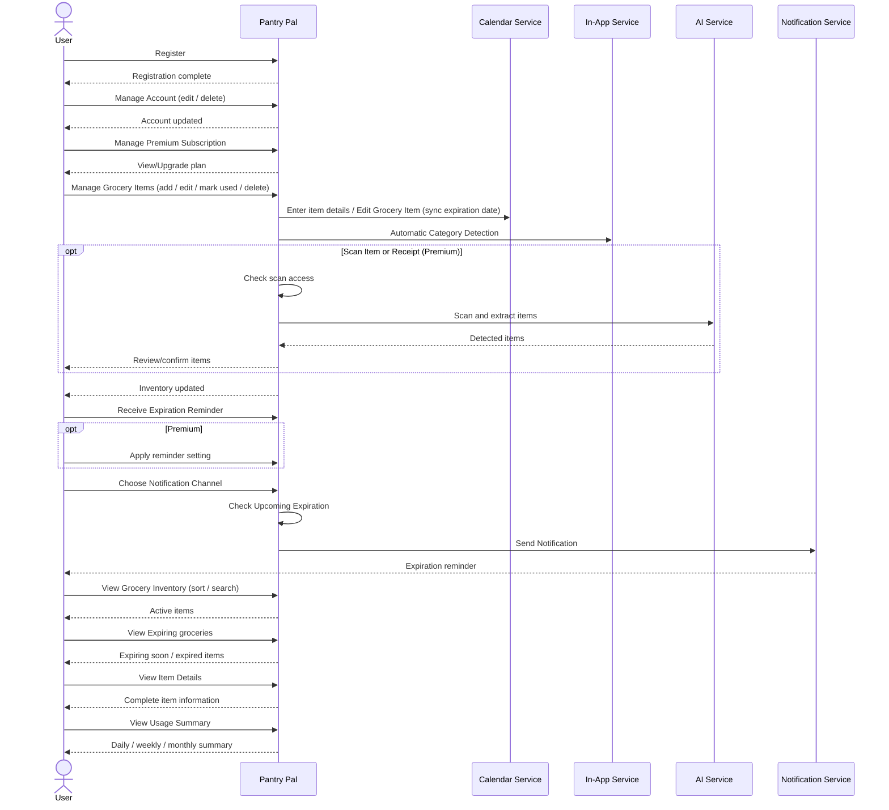

# Pantry Pal - Sequence Diagram

```mermaid
sequenceDiagram
    actor User
    participant App as Pantry Pal
    participant Cal as Calendar Service
    participant Cat as In-App Service
    participant AI as AI Service
    participant Notif as Notification Service

    User->>App: Register
    App-->>User: Registration complete

    User->>App: Manage Account (edit / delete)
    App-->>User: Account updated

    User->>App: Manage Premium Subscription
    App-->>User: View/Upgrade plan

    User->>App: Manage Grocery Items (add / edit / mark used / delete)
    App->>Cal: Enter item details / Edit Grocery Item (sync expiration date)
    App->>Cat: Automatic Category Detection
    opt Scan Item or Receipt (Premium)
        App->>App: Check scan access
        App->>AI: Scan and extract items
        AI-->>App: Detected items
        App-->>User: Review/confirm items
    end
    App-->>User: Inventory updated

    User->>App: Receive Expiration Reminder
    opt Premium
        User->>App: Apply reminder setting
    end
    User->>App: Choose Notification Channel
    App->>App: Check Upcoming Expiration
    App->>Notif: Send Notification
    Notif-->>User: Expiration reminder

    User->>App: View Grocery Inventory (sort / search)
    App-->>User: Active items

    User->>App: View Expiring groceries
    App-->>User: Expiring soon / expired items
    User->>App: View Item Details
    App-->>User: Complete item information

    User->>App: View Usage Summary
    App-->>User: Daily / weekly / monthly summary
```
